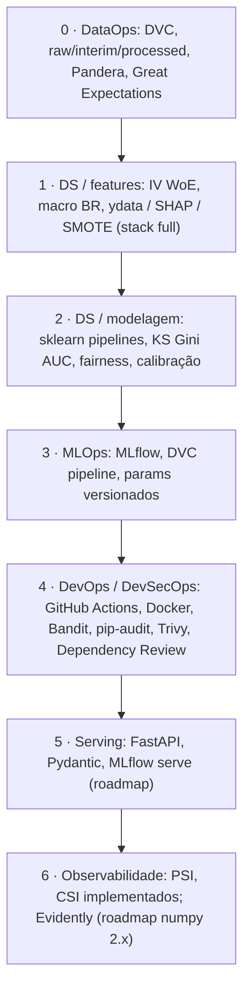

# AGENTS.md — German Credit Risk · Projeto Sênior de Data Science

> Este arquivo é lido automaticamente pelo Cursor como contexto do projeto.
> Toda interação com o agente deve seguir as diretrizes abaixo.

---

## 1. Identidade e objetivo do projeto

Você está trabalhando em um projeto de **análise de risco de crédito de alto nível** baseado no
dataset German Credit Risk (GCR), com enriquecimento de variáveis macroeconômicas brasileiras.

O objetivo é demonstrar maturidade analítica de cientista de dados sênior e familiaridade com
práticas de **MLOps**, **DataOps** (dados reproduzíveis e validados em pipeline), **DevOps** (CI/CD,
containers, automação), **DevSecOps** (SAST, auditoria de dependências, scan de imagem, revisão de
supply chain) e arquitetura de soluções em dados.

**Audiência do projeto:** recrutadores técnicos, tech leads e gestores de produto em empresas de
crédito, fintech ou consultoria de dados.

**Fonte de dados (não alterar o bruto):** o CSV do German Credit Risk deve residir em
`data/raw/credit_risk_dataset.csv` (separador `;`). A ingestão (`src.data.make_dataset`) lê **apenas**
desse caminho; não versionar mudanças no arquivo em `raw/`.

### Fluxo operacional (stages 0 → produção) — o que este repo demonstra

O desenho segue o fluxo “sênior” de risco de crédito: ingestão e qualidade → EDA/features →
modelagem com métricas de mercado → rastreio e governança → CI/CD → API → monitoramento (roadmap).



| Pilar | O que já dá para mostrar no CV / entrevista | Próximo degrau |
|-------|---------------------------------------------|----------------|
| **Ciência de dados** | IV/WoE em `iv_woe.py`/`build_features`, ydata-profiling + IV ranking + WoE bars + macro BR + SHAP (stub) em `01_eda.ipynb`; Platt scaling + Brier/ECE + fairness (gênero/idade) + scorecard (`scorecardpy`) em `03_modeling.ipynb`; métricas KS/Gini/AUC/Brier/ECE em `evaluate.py` | 04_report completo; Fairlearn métrica formal |
| **DataOps** | `make_dataset` → `validate` (Pandera + GX) → Parquet interim; `dvc.yaml` com stages | Remote DVC + data registry; checks em PR para schema drift |
| **MLOps** | MLflow em `train` (infer_signature, input_example, auto-registro); `registry.py` (promote Staging→Prod, compare, load); DVC stage `evaluate` com `metrics.json` + plots CSV; `params.yaml` versionado | Model Registry via remote; promoção automatizada em CI; assinatura de commit |
| **DevOps** | GHA paralelo (lint, test, security), cache Poetry, Makefile, Dependabot (Actions + pip + **Docker**); Dockerfile multi-stage + non-root + healthcheck; push GHCR (SHA, `latest`, semver via `metadata-action`); `make build` / `build-push` | Ambientes `staging`/`prod` com gates no GHA; assinatura de imagem (cosign) |
| **DevSecOps** | Bandit (SAST), pip-audit (CVEs runtime), Trivy SARIF, Dependency Review em PRs | Política de branch, assinatura de commits, secrets scanning |

**Regra de ouro:** cada evolução deve manter o fluxo acima — código em `src/`, estágio novo em `dvc.yaml`,
experimento de modelo com MLflow, mudança de segurança refletida no CI.

---

## 2. Estrutura de diretórios obrigatória

Sempre que criar ou mover arquivos, respeite esta estrutura (baseada em cookiecutter data science).
O nome da pasta raiz do Git pode ser `GermanCreditRisk`; a árvore lógica do produto segue `credit-risk/`:

```
credit-risk/
├── data/
│   ├── raw/                  # dados originais — nunca modificar
│   │   ├── credit_risk_dataset.csv
│   │   └── macro_brasil/     # séries do BACEN/IBGE (baixadas via python-bcb)
│   ├── interim/              # dados após limpeza e validação
│   └── processed/            # features.parquet, iv_summary.csv, woe_value_maps.joblib
├── notebooks/
│   ├── 01_eda.ipynb           # exploração com ydata-profiling + IV/WoE
│   ├── 02_feature_eng.ipynb   # engenharia de features + macro BR
│   ├── 03_modeling.ipynb      # experimentos MLflow-tracked
│   └── 04_report.ipynb        # relatório executivo final
├── src/
│   ├── __init__.py
│   ├── data/
│   │   ├── make_dataset.py    # pipeline de ingestão
│   │   ├── validate.py        # Pandera + orquestração GX
│   │   └── ge_suite.py        # suíte Great Expectations (GX Core)
│   ├── features/
│   │   ├── build_features.py  # IV, WoE, scorecard bins
│   │   └── macro_features.py  # coleta e merge de macro BR
│   ├── models/
│   │   ├── train.py           # treino com MLflow logging
│   │   ├── evaluate.py        # KS, Gini, AUC, fairness
│   │   └── predict.py         # scoring em batch ou online
│   └── visualization/
│       └── plots.py           # funções reutilizáveis de dataviz
├── api/
│   ├── main.py                # FastAPI app
│   ├── schemas.py             # Pydantic v2 models
│   └── Dockerfile
├── tests/
│   ├── test_features.py
│   ├── test_models.py
│   ├── test_api.py
│   ├── test_iv_woe.py
│   └── test_ge_suite.py
├── .github/
│   ├── workflows/
│   │   └── ci.yml             # lint ∥ test ∥ security → Docker + Trivy + dependency review
│   └── dependabot.yml         # atualização semanal (Actions + pip/poetry.lock)
├── great_expectations/
│   └── expectations/
│       └── german_credit_suite.json   # export da suíte (referência / DVC dep)
├── dvc.yaml                   # pipeline reproduzível
├── params.yaml                # hiperparâmetros versionados
├── pyproject.toml             # dependências + metadados (Poetry)
├── Makefile                   # atalhos: make train, make test, make serve
├── .pre-commit-config.yaml    # ruff + black + mypy
└── README.md
```

---

## 3. Stack tecnológica — use sempre estas ferramentas

### Qualidade de dados
- **Pandera** para validação de schema com type hints (`validate.py`)
- **Great Expectations** — suíte em `src/data/ge_suite.py`, export JSON em `great_expectations/expectations/`, validação in-memory no pipeline
- **python-bcb** para coleta automática de séries do BACEN (Selic, IPCA, desemprego, PIB)

### EDA e feature engineering
- **ydata-profiling** para relatório exploratório completo
- **IV / WoE:** implementação base em `src/features/iv_woe.py` (pandas; usada em `build_features`);
  **scorecardpy** (binning/IV/WoE “clássico”) no grupo Poetry opcional **`full`** (`poetry install --with full`)
- **SHAP** para explicabilidade global e local
- **imbalanced-learn** (SMOTE, BorderlineSMOTE) para tratamento de desbalanceamento
- Métricas de crédito padrão de mercado: **KS statistic**, **Gini coefficient**, **AUC-ROC**

### Modelagem
- **scikit-learn** Pipelines (não scripts soltos)
- **XGBoost** e **LightGBM** como challengers
- **scorecardpy** para scorecard interpretável (obrigatório em contexto de crédito)
- **Optuna** para otimização bayesiana de hiperparâmetros
- **sklearn-calibration** (Platt scaling) para calibração de probabilidades
- **Fairlearn** ou **AIF360** para análise de viés (gender, age — LGPD/BACEN)

### MLOps e rastreamento
- **MLflow** para tracking de experimentos, model registry e serving
- **DVC** para versionamento de dados e pipeline reproduzível
- Todo experimento deve logar: params, métricas, artefatos, dataset hash

### DevOps e qualidade de código
- **Poetry** + `pyproject.toml` para gestão de dependências (pacotes pesados no grupo opcional **`full`**)
- **ruff** para linting (substitui flake8 + isort)
- **black** para formatação
- **mypy** para type checking
- **pytest** + **pytest-cov**: **meta do projeto — cobertura mínima 80%** quando a suíte estiver madura;
  no CI, patamar incremental em `main`/`master` via `make test-cov-main` (subir `--cov-fail-under` conforme novos testes)
- **pre-commit** com hooks de ruff, black, mypy, trailing-whitespace
- **GitHub Actions:** jobs paralelos `lint`, `test`, `security` (cache compartilhado); em PRs `dependency-review-action` (supply chain); `make test-ci` / `test-cov-main` / `test-slow` conforme branch; `docker build` + **Trivy** (SARIF → Code scanning em `main`); ver `.github/workflows/ci.yml`
- **Dependabot:** `.github/dependabot.yml` (GitHub Actions + pip/poetry.lock)
- **Makefile:** `install`, `lint`, `test`, `test-ci`, `test-cov-main`, `test-slow`, `security` (bandit), `security-audit` (pip-audit), `train`, `serve`, `mlflow`, `clean`, `report`

### Serving e interface
- **FastAPI** com validação Pydantic v2
- **MLflow serve** ou **BentoML** para serving do modelo
- **Streamlit** para demo interativo com stakeholders

### Monitoramento
- **PSI** (Population Stability Index) em `src/monitoring/drift.py` — detecta deriva no score
- **CSI** (Characteristic Stability Index) em `src/monitoring/drift.py` — detecta deriva por feature
- **`src/monitoring/reference.py`** — persiste estatísticas de referência (após `make evaluate`)
- **`src/monitoring/report.py`** — gera `reports/monitoring_report.json` + HTML (`make monitor`)
- **Evidently AI** *(reintroduzir no `pyproject` quando houver release compatível com numpy 2.x)*

---

## 4. Análise macroeconômica brasileira — como integrar

O GCR foi coletado na Alemanha nos anos 1970–80. A abordagem correta **não é** comparação
temporal direta, mas sim usar o GCR como dataset estruturado de treinamento e enriquecer
a análise com contexto macro brasileiro atual.

### Narrativa analítica recomendada:
> "Como o perfil de risco de tomadores de crédito se comporta sob diferentes regimes
> macroeconômicos? O que o GCR nos ensina sobre variáveis universais de inadimplência,
> e como essas variáveis se relacionam com o contexto atual do crédito no Brasil?"

### Variáveis macro BR a coletar via python-bcb:

```python
from bcb import sgs

# Exemplo de coleta
series = {
    'selic': 432,        # Taxa Selic
    'ipca': 433,         # Inflação IPCA
    'desemprego': 24369, # Taxa de desemprego PNAD
    'pib': 4380,         # PIB real
    'credito_pf': 20539, # Carteira de crédito pessoa física
    'inadimplencia': 21082,  # Inadimplência total
}
df_macro = sgs.get(series, start='2015-01-01')
```

### Como incorporar no modelo:
1. Criar features de cenário macroeconômico como variáveis externas
2. Analisar como a distribuição das variáveis do GCR se alteraria sob Selic alta vs baixa
3. Construir um "stress test" do scorecard sob diferentes cenários macro
4. Incluir seção de análise qualitativa: diferenças estruturais BR × DE
   (rotatividade de emprego, informalidade, cheque especial, consignado)

---

## 5. Padrões de código obrigatórios

### Todo módulo Python deve ter:
```python
"""Docstring do módulo explicando propósito e uso."""

from __future__ import annotations

import logging
from pathlib import Path
from typing import Any

import pandas as pd
# ... demais imports

logger = logging.getLogger(__name__)

def minha_funcao(df: pd.DataFrame, param: float = 0.05) -> pd.DataFrame:
    """
    Clear description of what the function does.

    Args:
        df: DataFrame com as colunas X, Y, Z.
        param: Limiar de corte para filtragem.

    Returns:
        DataFrame transformado com as colunas A, B, C.

    Raises:
        ValueError: Se df não contiver a coluna obrigatória 'credit_risk'.
    """
    if "credit_risk" not in df.columns:
        raise ValueError("Coluna 'credit_risk' obrigatória ausente.")
    ...
```

### Todo treino de modelo deve logar no MLflow:
```python
import mlflow

with mlflow.start_run(run_name="xgboost_optuna_v1"):
    mlflow.log_params(params)
    mlflow.log_metrics({
        "ks_statistic": ks,
        "gini": gini,
        "auc_roc": auc,
        "f1_class0": f1_0,
        "f1_class1": f1_1,
    })
    mlflow.log_artifact("reports/classification_report.txt")
    mlflow.sklearn.log_model(pipeline, "model")
```

### Todo endpoint FastAPI deve ter schema Pydantic:
```python
from pydantic import BaseModel, Field, field_validator

class CreditRequest(BaseModel):
    account_status: int = Field(..., ge=1, le=4, description="Status da conta corrente")
    credit_duration: int = Field(..., gt=0, description="Duração do crédito em meses")
    credit_amount: float = Field(..., gt=0, description="Valor do crédito em DM")
    age: int = Field(..., ge=18, le=120, description="Idade do tomador")
    # ... demais campos

    @field_validator("credit_duration")
    @classmethod
    def duration_must_be_reasonable(cls, v: int) -> int:
        if v > 120:
            raise ValueError("Duração não pode exceder 120 meses.")
        return v
```

---

## 6. Seções obrigatórias no notebook de relatório final (04_report.ipynb)

1. **Executive summary** — 1 parágrafo, linguagem de negócio, sem jargão técnico
2. **Perfil da carteira** — distribuição das variáveis-chave com contexto de crédito
3. **Information Value (IV)** — ranking de poder preditivo de cada feature
4. **Scorecard** — pontuação interpretável para uso na esteira de análise
5. **Comparativo de modelos** — tabela KS / Gini / AUC / F1 por classe
6. **Análise de fairness** — distribuição de scores por gender e faixa etária
7. **Calibração** — curva de calibração (reliability diagram)
8. **Contexto macroeconômico BR** — seção qualitativa + features macro integradas
9. **Stress test** — comportamento do modelo em cenário de Selic alta e desemprego elevado
10. **Próximos passos** — roadmap de melhorias e itens de backlog

---

## 7. Comportamento esperado do agente Cursor

- **Nunca** criar scripts soltos fora da estrutura `src/`. Sempre perguntar em qual módulo
  o código pertence antes de escrever.
- **Sempre** adicionar type hints em funções novas.
- **Sempre** logar experimentos no MLflow quando treinar modelos.
- **Sempre** atualizar `dvc.yaml` quando um novo estágio do pipeline for criado.
- Quando sugerir um modelo novo, incluir a justificativa em termos de negócio
  (não apenas acurácia técnica).
- Preferir métricas de crédito (KS, Gini, PSI) sobre métricas genéricas de ML
  quando apresentar resultados para stakeholders.
- Comentários em código devem estar em **português** (projeto em contexto BR).
- Docstrings de funções públicas devem estar em **inglês** (padrão open-source).
- Ao criar visualizações, usar paleta consistente:
  inadimplente = vermelho (`#E24B4A`), adimplente = verde (`#639922`).

---

## 8. Comandos do Makefile — referência rápida

```makefile
make install       # instala dependências via Poetry
make lint          # ruff + black --check + mypy
make test          # pytest com cobertura (local; inclui todos os testes)
make test-ci       # CI rápido: pytest -m "not slow" --no-cov
make test-cov-main # CI main/master: not slow + cobertura + coverage.xml
make test-slow     # apenas @pytest.mark.slow (ex.: GX batch.validate)
make security      # Bandit SAST em src/ e api/
make security-audit # pip-audit no ambiente Poetry (lock reproduzível)
make train         # executa pipeline DVC completo
make serve         # sobe FastAPI local na porta 8000
make mlflow        # sobe MLflow UI na porta 5000
make clean         # remove artefatos temporários
make report        # executa notebook de relatório via nbconvert
```

Exportar JSON da suíte GX: `poetry run python -m src.data.ge_suite`

---

## 9. Contexto de domínio — leia antes de qualquer análise

O German Credit Risk classifica tomadores como:
- `credit_risk = 1` → **Bom** (adimplente)
- `credit_risk = 0` → **Mau** (inadimplente)

**Assimetria de custo:** no contexto de crédito, o custo de conceder crédito a um mau pagador
(falso positivo no sentido de negócio) é tipicamente 5× maior que o custo de recusar
crédito a um bom pagador. O threshold de decisão deve refletir essa assimetria.

**Diferenças estruturais Brasil × Alemanha relevantes para análise:**
- Taxa de informalidade BR (~40%) vs DE (~5%) — impacto em `employment_duration`
- Rotatividade de emprego BR é historicamente maior — impacto em estabilidade de renda
- Crédito consignado BR não existe no GCR — feature estruturalmente ausente
- Cheque especial BR tem características distintas de `account_status` do GCR
- LGPD (BR) e GDPR (DE) têm implicações diferentes para uso de dados pessoais em modelos
- Regulação BACEN resolução 4.557 exige documentação de modelos de risco

---

*Última atualização: alinhado ao roadmap sênior (stages 0–4), CI/CD no GitHub Actions e fonte única `data/raw/credit_risk_dataset.csv` — revisar conforme o projeto evolui.*
